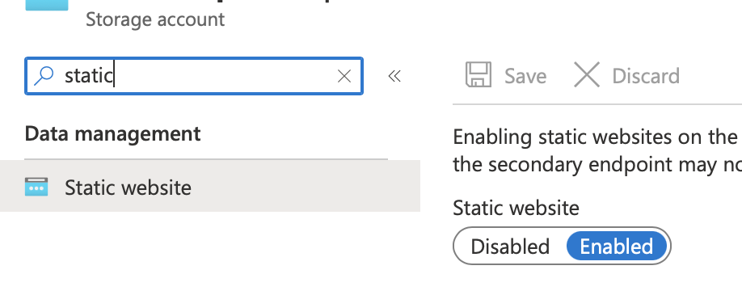

## Goal: Hosting a static site generated using Hugo on Azure
The entire site and all supporting processes will host in the Microsoft Azure cloud with Azure DevOps. 
In this post, I will explain how to host the site in Microsoft Azure. This assumes the example static files have already been built so you will see how it’s exposed to the world.


Let’s start with a high-level view of the current setup:
1. AN example DNS points to Azure CDN.
2. Azure CDN serves up the files in the site from different edge nodes around the world.
3. If the CDN has the requested file in cache, it returns it to the caller. 
   If not - the CDN pulls the file from where the files are stored, in an Azure Storage Blob container.


### Azure Storage Blob & Static Web Sites
It's better to use Azure Storage Blob to store the file for a static site with no dynamic server-side component to store the files. 
The static websites capability of Azure Storage Blobs serve as a web server.

After creating the Azure Storage Blob resource, select the Static website option in the navigation and flip the toggle to Enabled.
 

Azure will generate a URL for you in the form of https://<storageaccount>.z##.web.core.windows.net. It will also create a blob container $web where you can upload your files to.

At this point, you can upload your site there. 
But we sill discuss the automated CI/CD way using Azure DevOps.

### Automated Hugo Releases With Azure Pipelines

* Hugo site and its content are stored in an Azure DevOps repo.
* Build & deploy the static site immediately when updating to the `main` branch.
* Build & deploy only the `main` branch on a regular schedule every day:  
I use Hugo’s publishDate front matter capability. Because Hugo is static, only content that has no publishDate set or where the publishDate is before the build time will be included. Therefore, each rebuild and deploy the site will give that CMS-like publish schedule.


### Install Hugo 

```shell
hugo new site quickstart
cd quickstart
git init
git submodule add https://github.com/theNewDynamic/gohugo-theme-ananke.git themes/ananke
echo theme = \"ananke\" >> config.toml
hugo new posts/my-first-post.md
```

#### Start the Hugo server 
```shell
▶ hugo server -D
Start building sites …
hugo v0.96.0+extended darwin/amd64 BuildDate=unknown
WARN 2022/04/03 23:25:47 .File.UniqueID on zero object. Wrap it in if or with: {{ with .File }}{{ .UniqueID }}{{ end }}

                   | EN
-------------------+-----
  Pages            | 10
  Paginator pages  |  0
  Non-page files   |  0
  Static files     | 75
  Processed images |  0
  Aliases          |  0
  Sitemaps         |  1
  Cleaned          |  0

Built in 39 ms
Watching for changes in /Users/user/Documents/Git/{archetypes,content,data,layouts,static,themes}
Watching for config changes in /Users/user/Documents/Git/config.toml
Environment: "development"
Serving pages from memory
Running in Fast Render Mode. For full rebuilds on change: hugo server --disableFastRender
Web Server is available at http://localhost:1313/ (bind address 127.0.0.1)
Press Ctrl+C to stop
```
